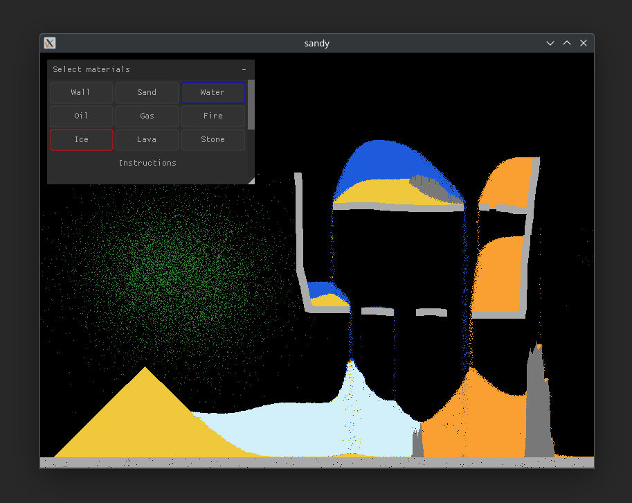

<h1>
  Sandy
  <br>
</h1>



<h4 align="center">Yet another falling sand simulator, developed using <a href="https://github.com/floooh/sokol">sokol</a> and <a href="https://github.com/Immediate-Mode-UI/Nuklear">nuklear.</a></h4>

### Compile and run
```shell
// needed for cross-platform shader compilation
git clone https://github.com/floooh/sokol-tools-bin.git

// linux
make linux
./sandy

// mac
make mac-opengl
./sandy

// wasm
make wasm
emrun sandy.html

```

### Profile
```shell
// run relevant build command from makefile with -g -O0 flags
perf record -g ./sandy
perf report

```

### Adding new materials

- Add material name to material enum
- Define material color in `draw_material`
- Create `process_<material_name>(int index)` function to define behavior
- Call process function in `process_world()`
- Add button to select material in `draw_ui`
